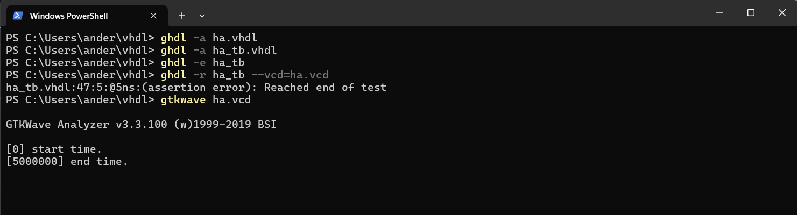
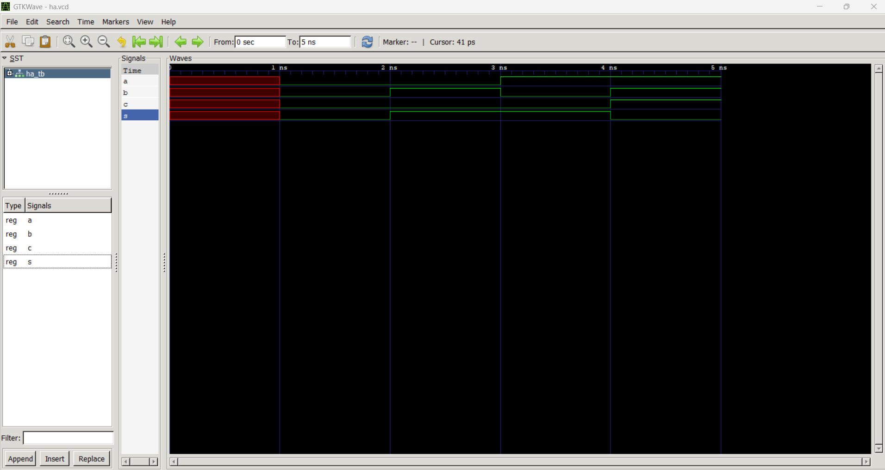
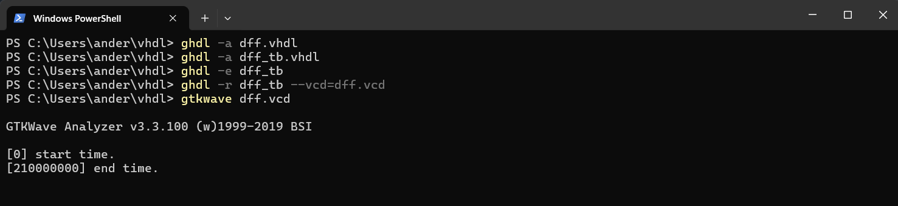
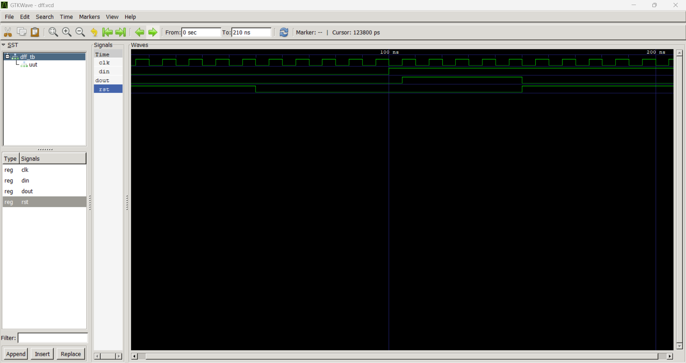

# CPE 322
## Lab 1: GHDL & GTKWave
### Instructions:
Go to the GitHub repository for Digital System Design( 
[DSD GitHub Repository](https://github.com/kevinwlu/dsd.git)
). Navigate to GHDL folder. Install GHDL & GTKWave. Run Half Adder Example and another example such as D Flip Flop or 4-1 Multiplexer. 
Document results on your GitHub repository. 

---

## Half Adder
**Half Adder Code:**

**Half Adder Result:**

---
## D Flip Flop
**D Flip Flop Code:**

**D Flip Flop Result:**

---

## Summary

---
Author: Sean Anderson  
I pledge my honor that I have abided by the Stevens Honor System.
