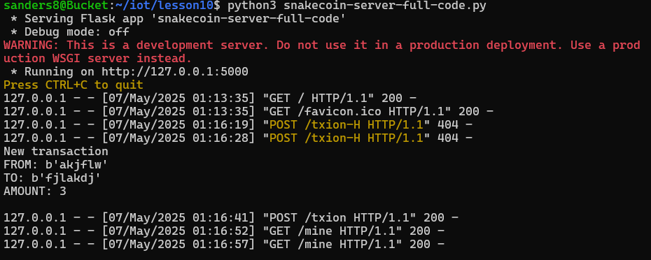
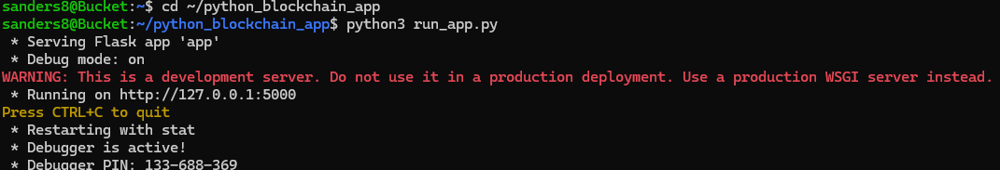

# Lab 10 
## Blockchain
### Instructions: 
Review lesson 10 in the GitHub repository.
- Run hash_value.py twice and compare results
- Run snakecoin.py
- Run snakecoin-server-full-code.py on Terminal 1 and mine a new block on Terminal 2
- Clone Python blockchain app and uncomment the last line of node_server.py
- Run node_server.py on Terminal 1 and run app.py on Terminal 2   

Document results to your GitHub repository.

---

## Contents of hash_value.py

## Running hash_value.py twice

After running hash_value.py twice, it could be seen that the hash value of 1, 1.0, and 3.14 remained the same but the hash value of Python, tuple of vowels, and object of person changed.

## Running snakecoin.py

## Running snakecoin-server-full-code.py on Terminal 1

## Result of running snakecoin-server-full-code.py

## Mining a new block on Terminal 2

## Result of mining a new block

## Cloning Python blockchain app

## Uncommented last line of node_server.py

## Running node_server.py on Terminal 1

## Result of running node_server.py

## Running run_app.py on Terminal 2

## Result of running run_app.py and requesting mine

## Resync result

---
Author: Sean Anderson  
I pledge my honor that I have abided by the Stevens Honor System.
