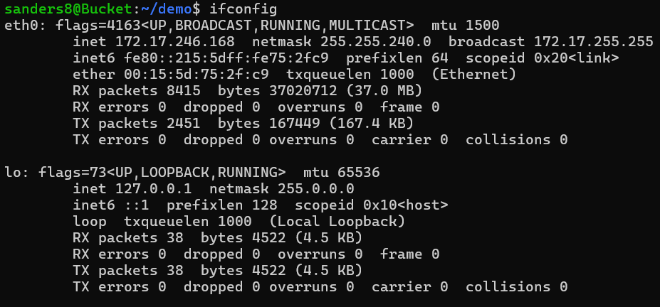

# CPE 322
## Lab 2: Command Line
### Instructions:
Go to the IOT repository. Review Lessons 1 and 2. Then, open a terminal and enter the following commands: 
`hostname`, 
`env`, 
`ps`, 
`pwd`, 
`git clone https://github.com/kevinwlu/iot.git`, 
`cd iot`, 
`ls`, 
`cd`, 
`df`, 
`mkdir demo`, 
`cd demo `, 
`nano file`, 
`cat file`, 
`cp file file1`, 
`mv file file2`, 
`rm file2`, 
`clear`, 
`man uname`, 
`uname -a`, 
`ifconfig`, 
`ping localhost`, 
`netstat`. 
Document results to GitHub repository.

---

## hostname

## env

## ps

## pwd

## git clone https://github.com/kevinwlu/iot.git, cd iot, ls, and cd

## df

## mkdir demo, cd demo, and nano file

## inside of file after nano file

## cat file

## cp file file1

## mv file file2

## rm file2

## Before clear

## After clear

## man uname

## result of man uname

## uname -a

## ifconfig

## ping localhost

## netstat

---

Author: Sean Anderson  
I pledge my honor that I have abided by the Stevens Honor System.
