# Lab 3
## Python 
### Instructions:
Go to the IOT GitHub repository and review lesson 3. Install required Python packages such as jdcal, astral, and geopy. Execute the following code:  
`cd ~/iot`,
`cd *3`,
`python3 julian.py`,
`python3 date_example.py`,
`python3 datetime_example.py`,
`python3 time_example.py`,
`python3 sun.py "New York"`,
`python3 moon.py`,
`python3 coordinates.py "Samuel C. Williams Library"`,
`python3 address.py "40.74480675, -74.02532861159351"`,
`python3 cpu.py`,
`python3 battery.py`,
`python3 documentstats.py document.txt`.
  
Document the results to your GitHub repository. 

---

## cd ~/iot and cd *3
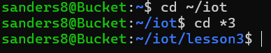

## python3 julian.py
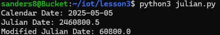

## python3 date_example.py
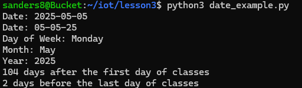

## python3 datetime_example.py
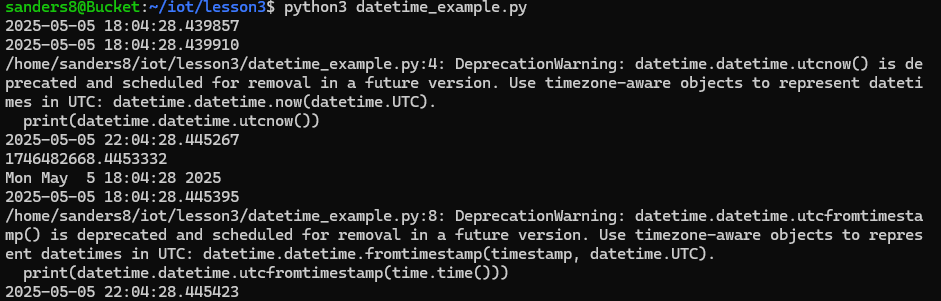

## python3 time_example.py
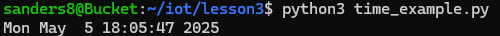

## python3 sun.py "New York"
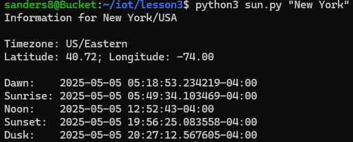

## python3 moon.py
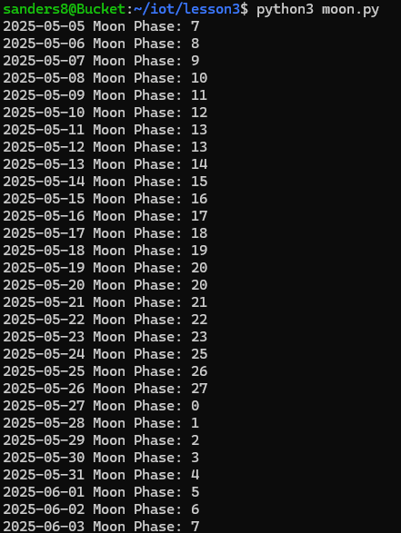

## python3 coordiantes.py "Samuel C. Williams Library"
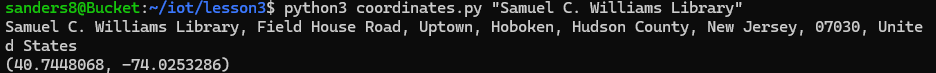

## python3 address.py "40.74480675, -74.02532861159351"
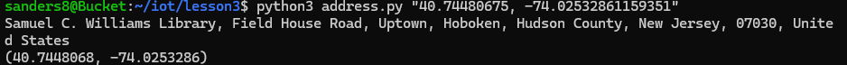

## python3 cpu.py
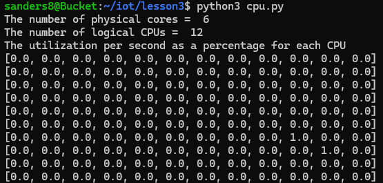

## python3 battery.py
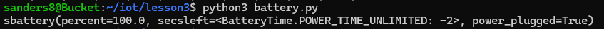

## python3 documentstats.py document.txt
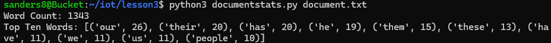

---
Author: Sean Anderson  
I pledge my honor that I have abided by the Stevens Honor System.
