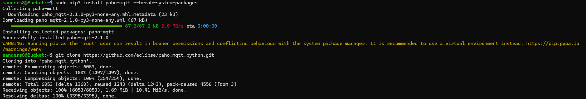
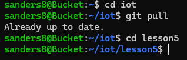
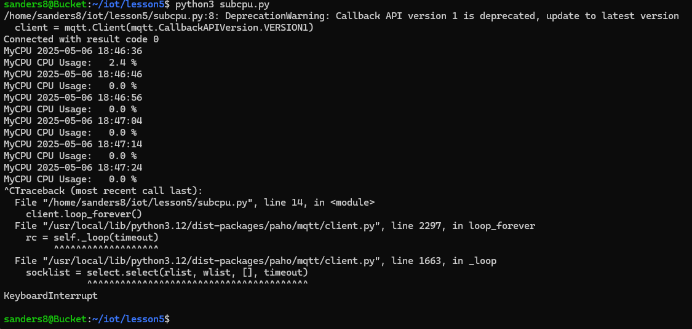
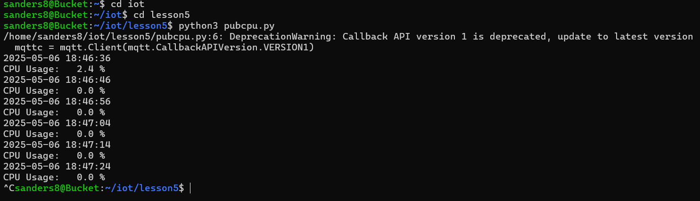

# Lab 5
## Paho - MQTT
### Instructions: 
Go to the iot GitHub repository and review Lesson 5. Install Paho-MQTT. Change directories to the iot repository and update the repository with `git pull `. Then change directories to lesson5. Run `python3 subcpu.py` on one terminal and `python3 pubcpu.py` on another. Document the results to your GitHub repository.

---

## Installation of Paho-MQTT

## cd into iot/lesson5 and git pull

## Terminal 1 with python3 subcpu.py

## Terminal 2 with python3 pubcpu.py

---
Author: Sean Anderson  
I pledge my honor that I have abided by the Stevens Honor System.
