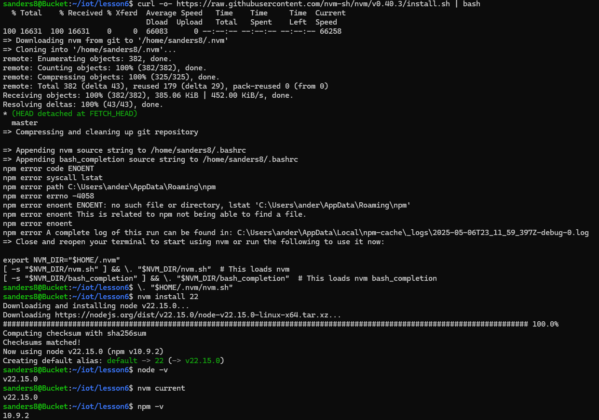
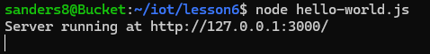
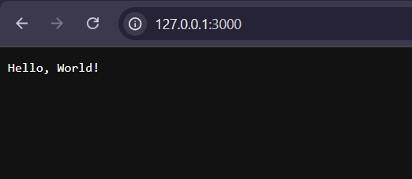
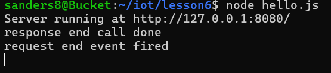
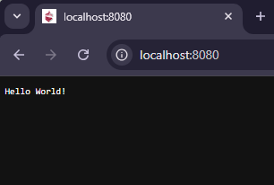
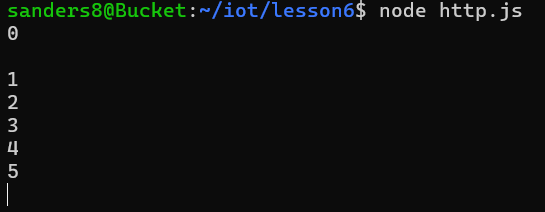
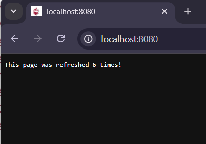
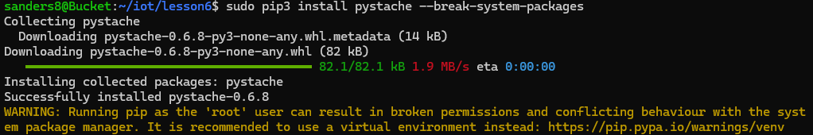
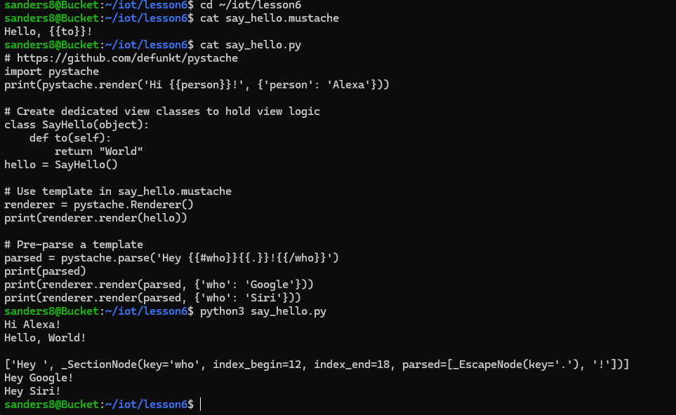

# Lab 6
## Node.js and Pystache
### Instructions:
Go to lesson 6 in the GitHub repository. Install Node.js and run hello-world.js, hello.js, and http.js. For each, refresh the webpage to see the server activities. Then, installl Pystache 
and run say_hello.py that uses the template say_hello.mustache. Document your results to your GitHub repository.

---

## Installing Node.js

## Running node hello-world.js

## Webpage result of running node hello-world.js

## Running node hello.js

## Webpage result of running node hello.js

## Running node http.js

## Webpage result of running node http.js

## Installing Pystache

## Running python3 say_hello.py

---

Author: Sean Anderson  
I pledge my honor that I have abided by the Stevens Honor System. 
