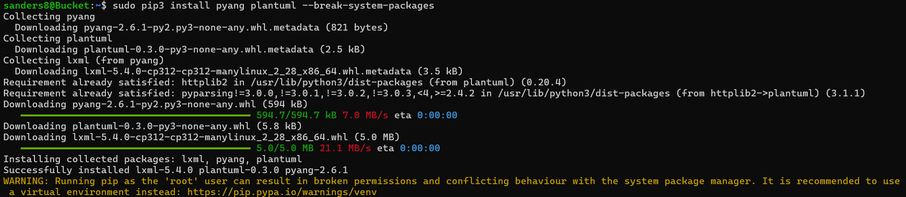
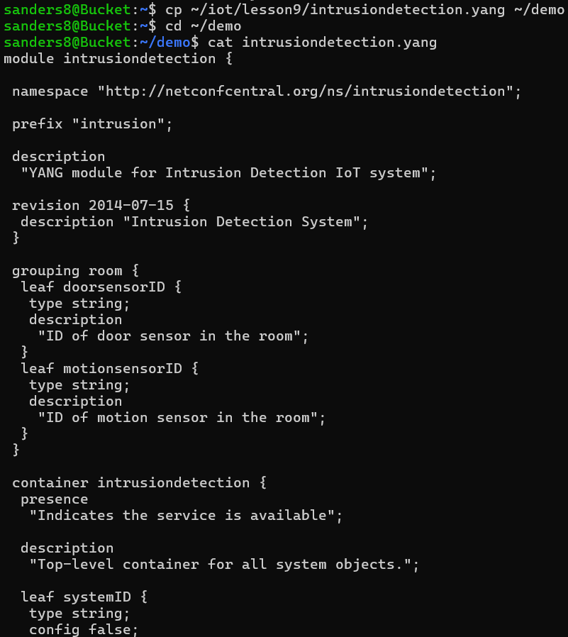
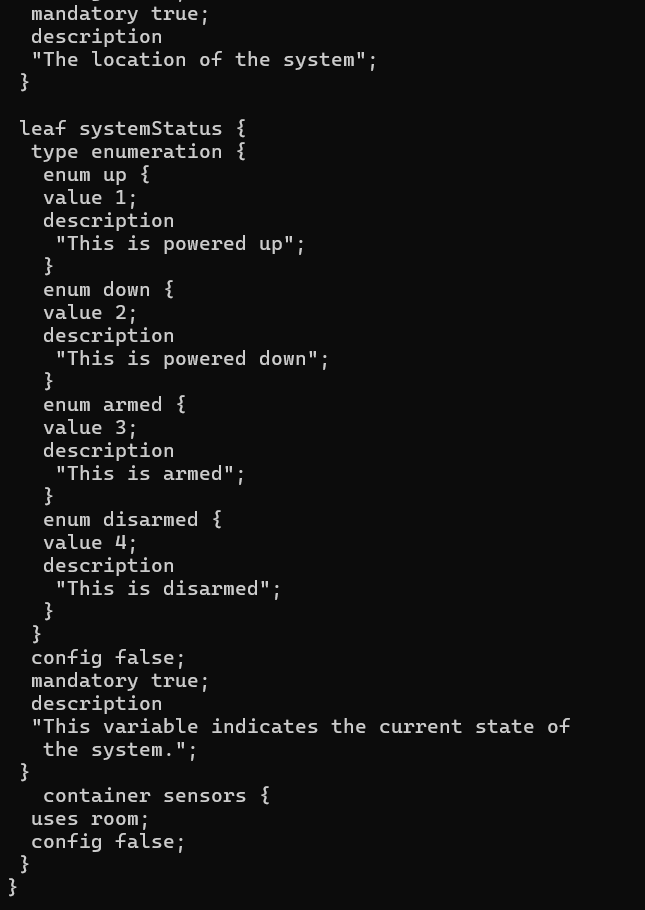
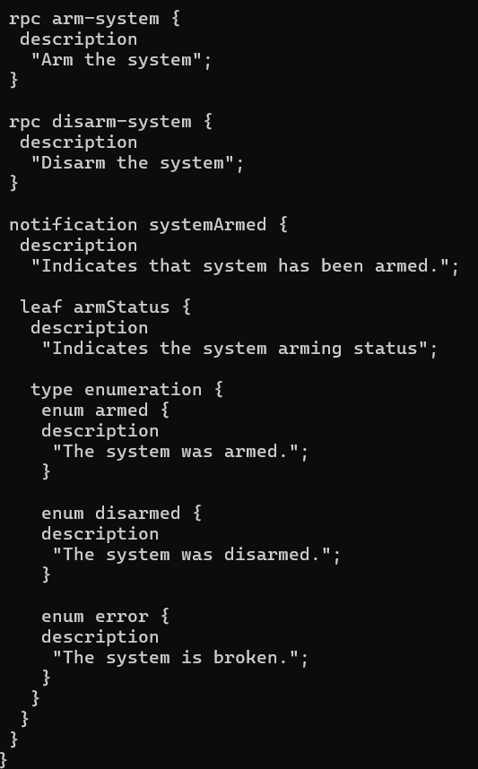
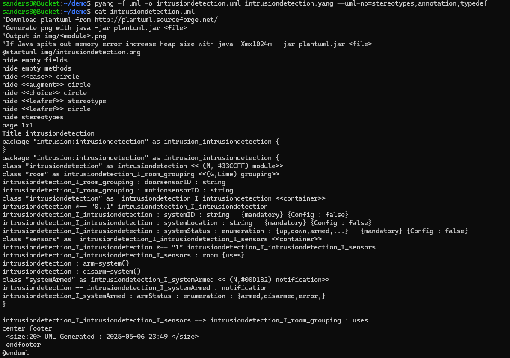
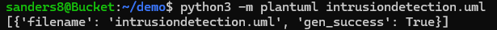
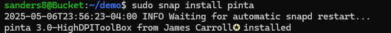
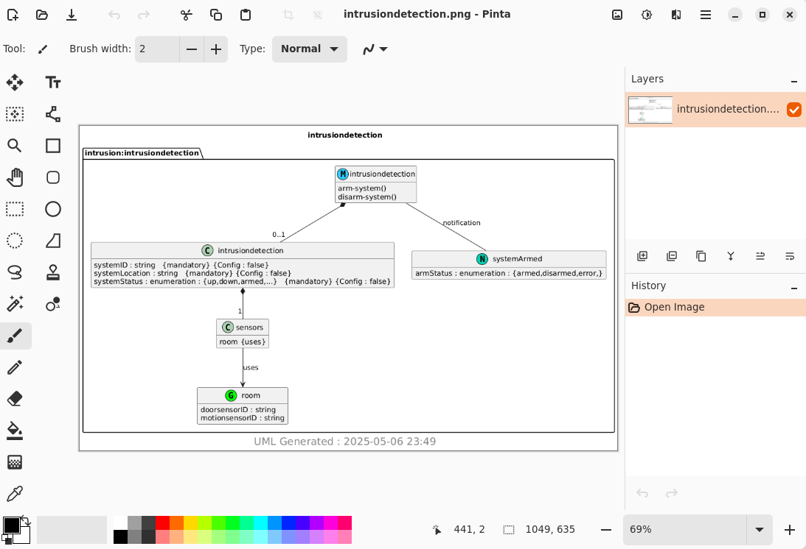
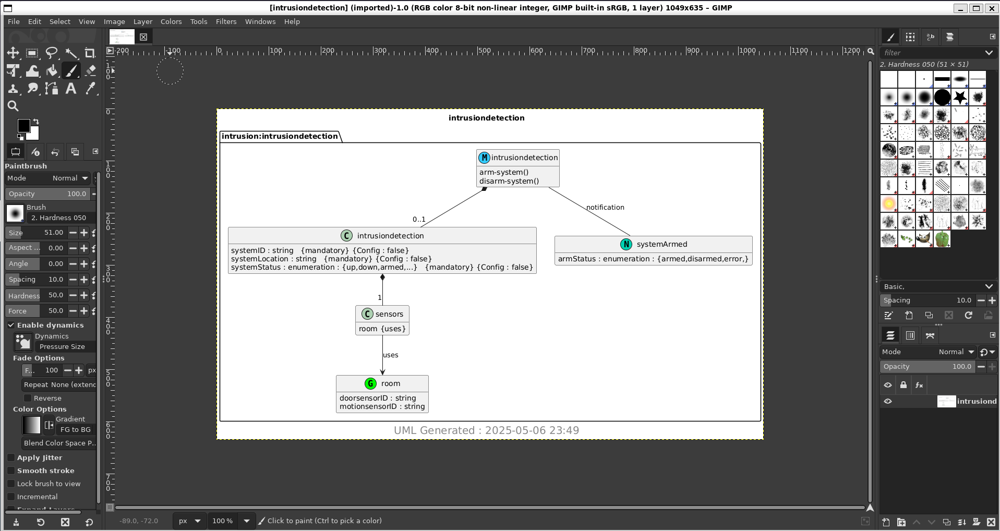

# Lab 9 
## YANG
### Instructions: 
Review lesson 9 in the GitHub repository. Install pyang and PlantUML. Copy ~/iot/lesson9/intrusiondetection.yang to ~/demo. Run pyang to generate intrusiondetection.yin and intrusiondetection.uml. Run PlantUML to generate intrusiondetection.png. Document results to your GitHub repository. 

---

## Installing pyang and PlantUML

## cp ~/iot/lesson9/intrusiondetection.yang to ~/demo

## Running pyang to generate intrusiondetection.yin

## Running pyang to generate intrusiondetection.uml

## Running PlantUML to generate intrusiondetection.png

## Installing pinta

## Result of pinta -a intrusiondetection.png

## Installing gimp

## Result of gimp -a intrusiondetection.png

---
Author: Sean Anderson  
I pledge my honor that I have abided by the Stevens Honor System.
